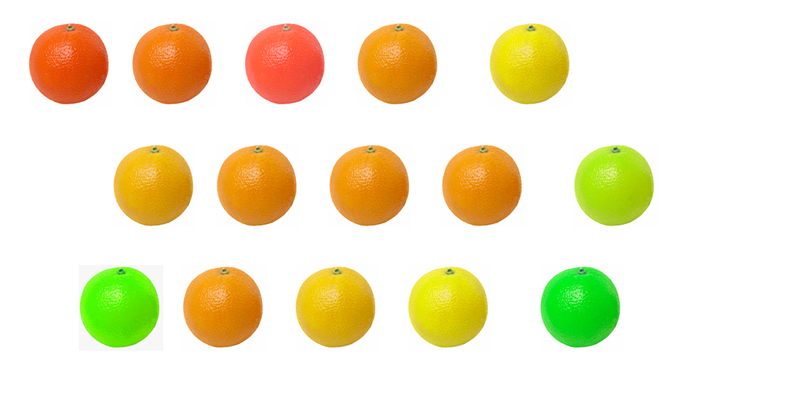
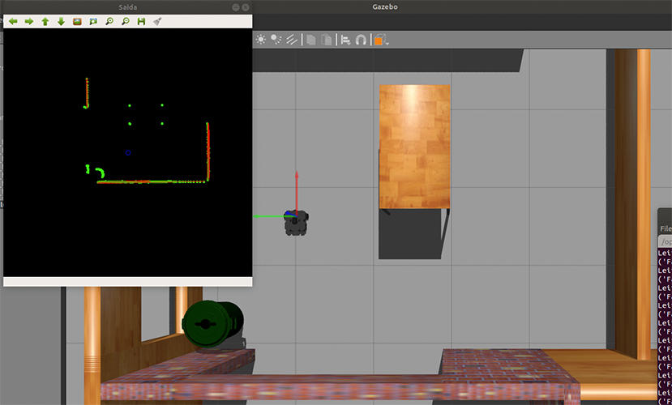

# Robótica Computacional

## Simulado

Observações de avaliações nesta disciplina:
* É necessário ter pelo menos $50\%$ de nota nesta prova
* Quem não tiver nota mínima nesta prova pode fazer a P2 versando sobre o mesmo conteúdo na semana das avaliações finais. Valerá a maior nota dentre as provas

Orientações gerais:
* Você pode consultar a *Internet* livremente, mas não pode se comunicar com outras pessoas da turma ou de fora dela sobre o conteúdo da prova. Tentativas de comunicação serão severamente punidas.
* Ao final da prova, envie o repositório dando git push
* A responsabilidade por ter o *setup* funcionando é de cada estudante
* Haverá uma planilha compartilhada com fila para dúvidas. Indique nela se seu problema é de **infra** ou **geral**

Existe algumas dicas de referência rápida de setup [instrucoes_setup.md](instrucoes_setup.md)

# Questões

## Questão 1 

Execute a simulação *Turtlebot House* 

    roslaunch turtlebot3_gazebo turtlebot3_house.launch 

Você vai ver uma cena como a abaixo. O robô começa numa sala com lata de lixo e uma mesa.

[./media/cena.png]

O que você deve fazer: Modificar os programas para que o robô sempre centralize e avance na direção de qualquer objeto destas 3 categorias: chair pottedplant bottle

O robô deve inicialmente começar girando lentamente.

Trabalhe em cioma do p1_mobilenet.py principalmente, mas pode editar outros, se necessário.

        rosrun p1_sim p1_mobilenet.py 

Dicas:
A centralização não precisa ser perfeita, adote uma margem de tolerância

|Resultado| Conceito| 
|---|---|
| Não executa | 0 |
| Consegue detectar objetos das categorias  chair pottedplant bottle e centralizar  | 1.5 |
| Realiza ações no sentido de mover mas não converge, mas não converge ou a rotação não é no sentido ótimo | 2.0 |
| Avança corretamente | 4.0 | 

Casos intermediários ou omissos da rubrica serão decididos pelo professor.

## Questão 2

Você foi contratado para desenvolver um sistema de visão computacional para um robô que vai trabalhar com colheita de toranjas.

O cliente passou a você uma escala de cores que identifica quais toranjas são verdes e quais são maduras.

A linha azul determina a partir de qual cor você pode considerar uma toranja madura

Considere que a componente `H` (Hue) das imagens vai definir o critério se uma fruta é madura ou não.

Pede-se: Faça um código que conte e identifique na  imagem quantas toranjas maduras estão presentes.

Dicas:
* Lembre-se da aula 2
* Só precisa funcionar **para esta vídeo em particular**, não para quaisquer toranjas
* Não é uma questão de ROS. Trabalhe na pasta `p1_webcam`
* Você pode usar Python 2 ou Python 3 conforme preferir

|Resultado| Conceito| 
|---|---|
| Não executa | 0 |
| Seleciona laranjas corretamente e obtém máscara | 1.0 |
| Conta laranjas | 1.5 |
| Desenha círculo só sobre as maduras | 2.5 | 

Casos intermediários ou omissos da rubrica serão decididos pelo professor.

# Questão 3 - ROS + cv

**Atenção: você vai usar OpenCV mas não vai trabalhar com imagens de câmera**

Você deve trabalhar no arquivo `le_scan_grafico.py`

O que você deve fazer:
* Leia os dados do *lidar* 
* Represente o robô na coordenada 256,256 da imagem usando um círculo
* Adotando a escala $1 pixel = 2 cm$ desenhe todas as leituras válidas do lidar na imagem
* Traça as retas encontradas usando a transformada de Hough Lines

O resultado deve ficar parecido com o da figura abaixo. Note que na janela observa-se os mesmos objetos que o robô está vendo.

|Resultado| Conceito| 
|---|---|
| Não executa | 0 |
| Desenha os pontos corretamente | 1.5 |
|  Traça a reta | 2.5 | 

## Questão 4

**1.0 ponto**

Qual técnica usada para detectar chair pottedplant e bottle os na questão 1? 

Existe algum outro jeito de detectar esta lata de lixo preta e fazer o robô centralizar nela?

